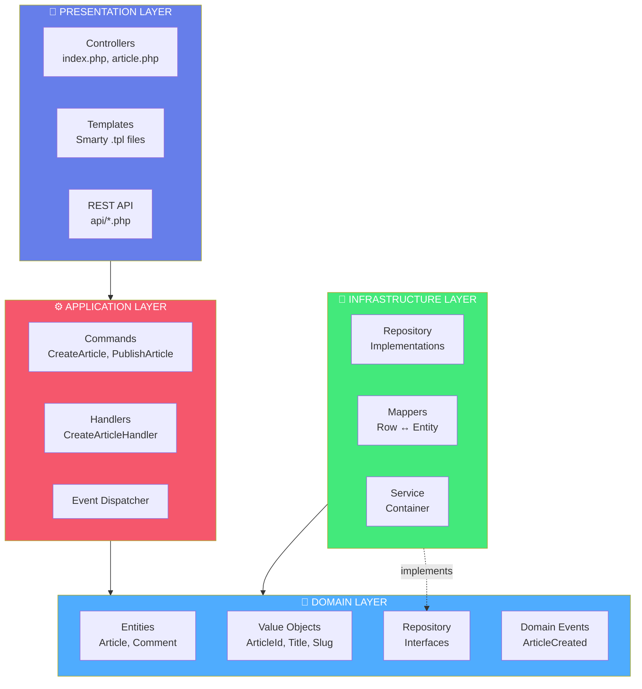
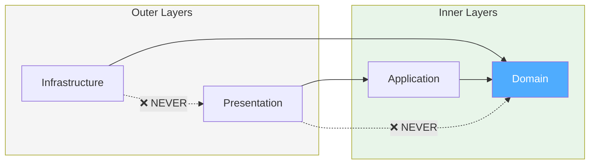
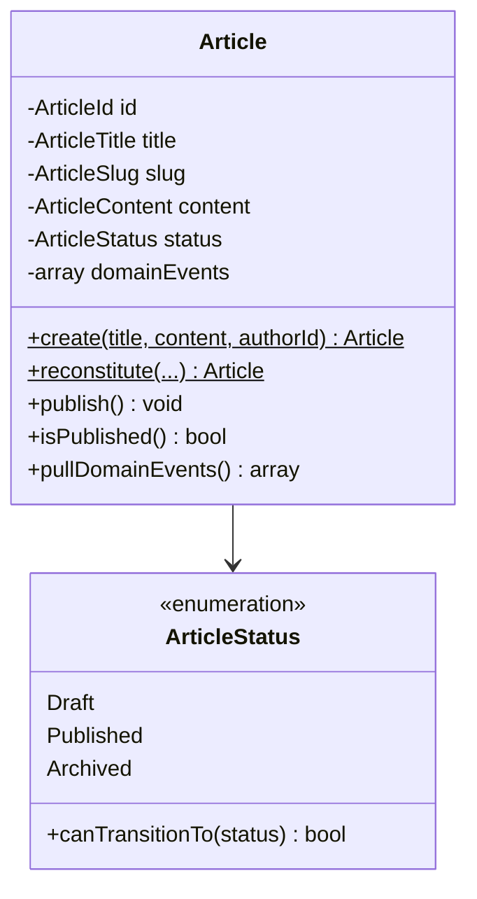
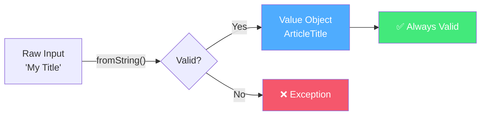
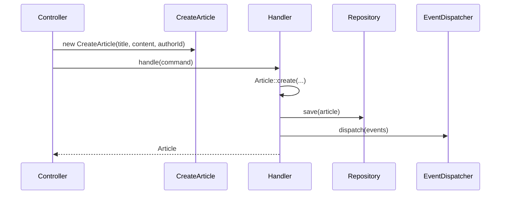
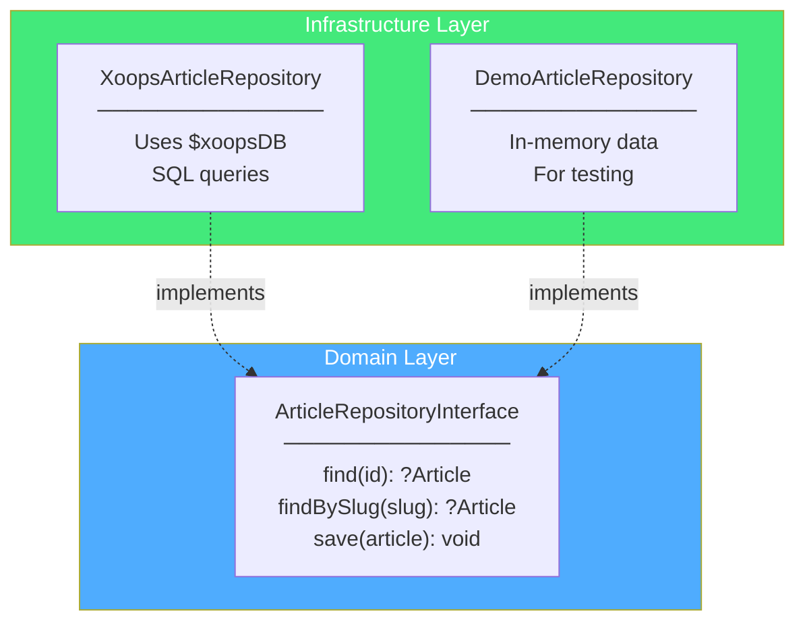
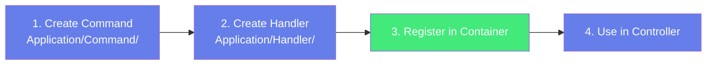
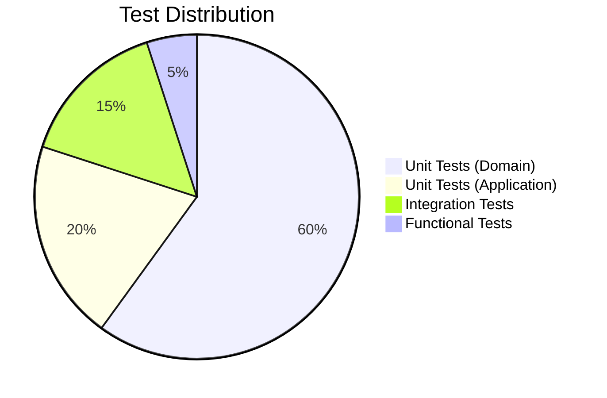
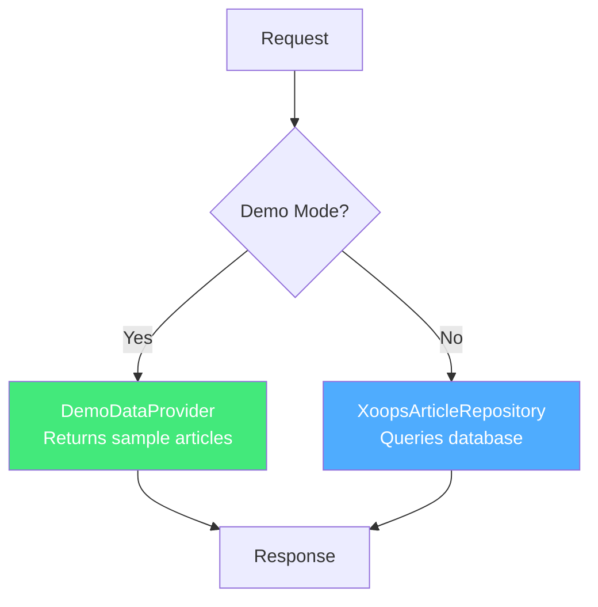

# Vision 2026 Module for XOOPS CMS

## Project Overview

Vision 2026 is a reference implementation demonstrating Clean Architecture and Domain-Driven Design patterns for XOOPS CMS. It serves as the blueprint for modern XOOPS module development.

### Goals

1. Demonstrate Clean Architecture in a real XOOPS module
2. Show how to build testable code without XOOPS dependencies
3. Provide patterns that can be adopted by other modules
4. Bridge the gap between XOOPS 2.5.x and XOOPS 2026

---

## Architecture

### Layer Overview



### The Dependency Rule

**Critical:** Dependencies flow inward only. The Domain layer has ZERO external dependencies.



---

## Directory Structure

```
vision2026/
├── src/
│   ├── Domain/                 # Pure PHP - NO dependencies
│   │   ├── Entity/
│   │   │   ├── Article.php     # Aggregate root
│   │   │   └── ArticleStatus.php # PHP 8.1 enum
│   │   ├── ValueObject/
│   │   │   ├── ArticleId.php   # ULID identifier
│   │   │   ├── ArticleTitle.php
│   │   │   ├── ArticleSlug.php
│   │   │   └── ArticleContent.php
│   │   ├── Event/
│   │   │   ├── ArticleCreated.php
│   │   │   └── ArticlePublished.php
│   │   ├── Repository/
│   │   │   └── ArticleRepositoryInterface.php
│   │   └── Exception/
│   │       └── ArticleNotFoundException.php
│   │
│   ├── Application/
│   │   ├── Command/
│   │   │   ├── CreateArticle.php
│   │   │   └── PublishArticle.php
│   │   ├── Handler/
│   │   │   ├── CreateArticleHandler.php
│   │   │   └── PublishArticleHandler.php
│   │   └── EventDispatcher/
│   │       └── EventDispatcherInterface.php
│   │
│   └── Infrastructure/
│       ├── Persistence/
│       │   ├── XoopsArticleRepository.php
│       │   └── ArticleMapper.php
│       ├── Container/
│       │   └── ServiceContainer.php
│       └── Demo/
│           └── DemoDataProvider.php
│
├── tests/
│   └── Unit/
│       └── Domain/
│           ├── Entity/
│           │   └── ArticleTest.php
│           └── ValueObject/
│               ├── ArticleIdTest.php
│               └── ArticleTitleTest.php
│
├── admin/
│   ├── index.php
│   └── menu.php
├── templates/
├── config/
│   └── demo.php
├── index.php
├── article.php
└── xoops_version.php
```

---

## Key Patterns

### 1. Entity with Factory Methods



**Key insight:** Use `create()` for new entities (fires events), `reconstitute()` for loading from database (no events).

### 2. Value Object Validation



### 3. Command/Handler Pattern



### 4. Repository Pattern



---

## Working with This Codebase

### Adding a New Entity

1. Create the Entity in `src/Domain/Entity/`
2. Create Value Objects in `src/Domain/ValueObject/`
3. Create Domain Events in `src/Domain/Event/`
4. Create Repository Interface in `src/Domain/Repository/`
5. Create Repository Implementation in `src/Infrastructure/Persistence/`
6. Add to ServiceContainer
7. Write unit tests (Domain layer only needs PHPUnit)

### Adding a New Command



### Testing Strategy



**Unit tests for Domain layer:**
- No mocks needed
- No database
- No XOOPS
- Run in milliseconds

---

## Demo Mode

When `config/demo.php` has `'enabled' => true`:



Demo mode provides 5 sample articles with educational content about Clean Architecture.

---

## Common Tasks

### Run Tests
```bash
composer test
```

### Check Code Style
```bash
composer cs-check
```

### Enable Demo Mode
```php
// config/demo.php
return ['enabled' => true];
```

### Create a New Article (Code)
```php
$command = new CreateArticle(
    ArticleTitle::fromString('My Title'),
    ArticleContent::fromString('Content here'),
    AuthorId::fromInt($userId)
);

$article = $handler->handle($command);
```

---

## Integration with XOOPS

### What Stays Traditional
- `xoops_version.php` — Module manifest
- `admin/menu.php` — Admin menu
- `templates/*.tpl` — Smarty templates
- XOOPS bootstrap (`mainfile.php`, `header.php`)

### What's New
- PSR-4 autoloading via Composer
- Dependency injection via ServiceContainer
- Domain logic isolated from XOOPS
- Unit tests without XOOPS bootstrap

---

## Resources

- [WALKTHROUGH.md](docs/WALKTHROUGH.md) — Step-by-step request flow
- [COMPARISON.md](docs/COMPARISON.md) — Traditional vs Vision 2026
- [Knowledge Base](../XOOPS-Knowledge-Base/10-Vision2026-Module/) — Full documentation

---
