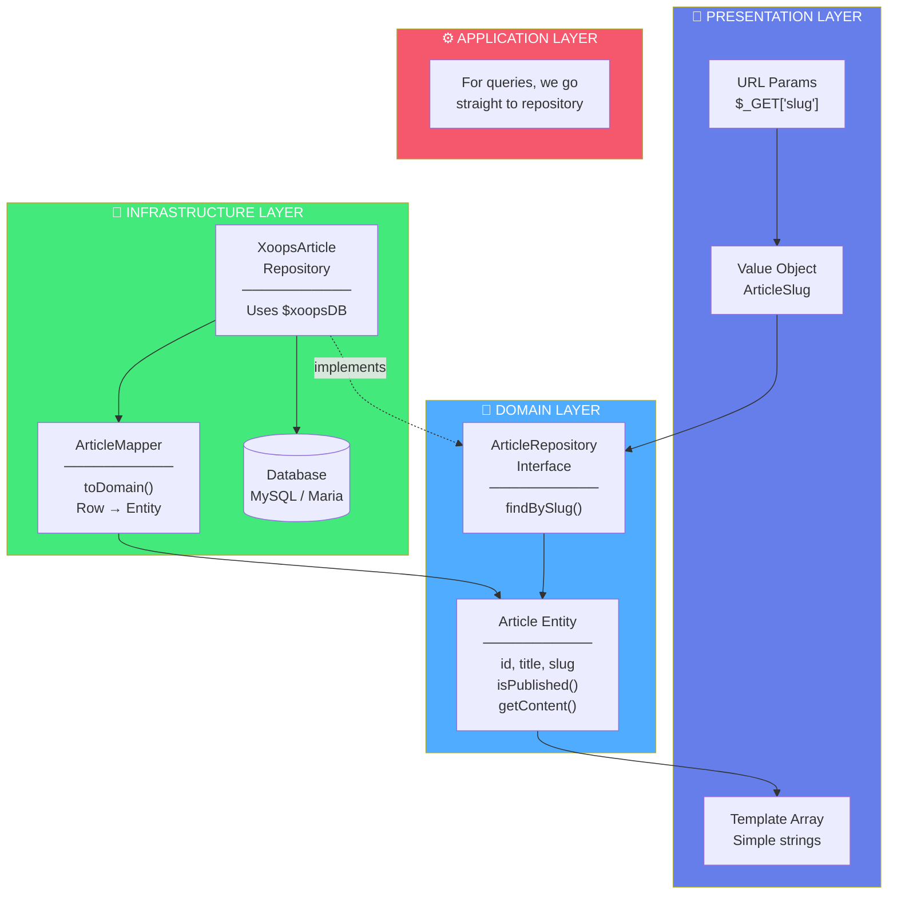

# Vision 2026: Step-by-Step Code Walkthrough

> This document walks through how a request flows through the Vision 2026 architecture, from URL to database. Perfect for newcomers learning Clean Architecture.

---

## 🎬 The Scenario

A user visits this URL:
```
/modules/vision2026/article.php?slug=getting-started-with-clean-architecture
```

Let's trace exactly what happens, line by line.

---

## Step 1: Entry Point (`article.php`)

```php
<?php
// article.php - The Presentation Layer entry point

// 1. Bootstrap XOOPS (this is still traditional XOOPS)
require_once dirname(__DIR__, 2) . '/mainfile.php';
require_once XOOPS_ROOT_PATH . '/header.php';

// 2. Load module's autoloader (Composer)
require_once __DIR__ . '/vendor/autoload.php';

// 3. Import the classes we need
use Vision2026\Infrastructure\Container\ServiceContainer;
use Vision2026\Domain\Repository\ArticleRepositoryInterface;
use Vision2026\Domain\ValueObject\ArticleSlug;
```

**What's happening here?**
- Traditional XOOPS bootstrap loads first (mainfile.php, header.php)
- Then we load Composer's autoloader for our clean architecture classes
- Notice the `use` statements: we're importing from `Domain` and `Infrastructure`

---

## Step 2: Create the Value Object

```php
// Get the slug from URL
$slugString = $_GET['slug'];  // "getting-started-with-clean-architecture"

// Create a Value Object - THIS VALIDATES THE INPUT!
$slug = ArticleSlug::fromString($slugString);
```

**Let's look inside `ArticleSlug`:**

```php
// src/Domain/ValueObject/ArticleSlug.php
final readonly class ArticleSlug
{
    private function __construct(
        public string $value
    ) {}

    public static function fromString(string $value): self
    {
        $value = trim($value);

        // Validation happens HERE, once, at creation
        if ($value === '') {
            throw new InvalidArgumentException('Slug cannot be empty');
        }

        if (!preg_match('/^[a-z0-9]+(?:-[a-z0-9]+)*$/', $value)) {
            throw new InvalidArgumentException(
                'Slug must be lowercase alphanumeric with hyphens'
            );
        }

        if (strlen($value) > 255) {
            throw new InvalidArgumentException('Slug too long');
        }

        return new self($value);
    }
}
```

**Key insight:** After `fromString()` succeeds, you have a *guaranteed valid* slug. You can pass this object anywhere without checking validity again!

---

## Step 3: Get the Repository (Dependency Inversion)

```php
// Get the service container
$container = ServiceContainer::getInstance();

// Ask for the Repository INTERFACE (not the concrete class!)
$articleRepository = $container->get(ArticleRepositoryInterface::class);
```

**Why use an interface?**

```php
// src/Domain/Repository/ArticleRepositoryInterface.php
interface ArticleRepositoryInterface
{
    public function find(ArticleId $id): ?Article;
    public function findBySlug(ArticleSlug $slug): ?Article;
    public function save(Article $article): void;
    // ... more methods
}
```

The Domain layer defines WHAT we need (the interface), but doesn't care HOW it's implemented. This is the **Dependency Inversion Principle**.

The container returns the concrete implementation:

```php
// src/Infrastructure/Container/ServiceContainer.php
$this->container[ArticleRepositoryInterface::class] =
    new XoopsArticleRepository($connection);
```

---

## Step 4: Query the Repository

```php
// Use the Value Object to find the article
$article = $articleRepository->findBySlug($slug);
```

**Inside the Infrastructure Layer:**

```php
// src/Infrastructure/Persistence/XoopsArticleRepository.php
public function findBySlug(ArticleSlug $slug): ?Article
{
    // Build query using XOOPS database
    $sql = "SELECT * FROM {$this->tableName}
            WHERE slug = :slug AND deleted_at IS NULL";

    $result = $this->connection->query($sql, [
        'slug' => $slug->value  // Extract string from Value Object
    ]);

    if (!$row = $result->fetch()) {
        return null;  // Not found
    }

    // Transform database row to Domain Entity
    return $this->mapper->toDomain($row);
}
```

**Key insight:** Database code is ONLY in the Infrastructure layer. The Domain layer has no idea we're using MySQL!

---

## Step 5: The Mapper (Database Row → Domain Entity)

```php
// src/Infrastructure/Persistence/ArticleMapper.php
public function toDomain(array $row): Article
{
    // reconstitute() creates entity without firing events
    // (the article already exists, we're just loading it)
    return Article::reconstitute(
        id: ArticleId::fromString($row['id']),
        title: ArticleTitle::fromString($row['title']),
        slug: ArticleSlug::fromString($row['slug']),
        content: ArticleContent::fromString($row['content']),
        authorId: AuthorId::fromInt((int) $row['author_id']),
        status: ArticleStatus::from($row['status']),
        createdAt: new DateTimeImmutable($row['created_at']),
        publishedAt: $row['published_at']
            ? new DateTimeImmutable($row['published_at'])
            : null
    );
}
```

**Why `reconstitute()` instead of `create()`?**

```php
// Article::create() - For NEW articles
public static function create(...): self
{
    $article = new self(...);
    $article->recordEvent(new ArticleCreated($id));  // Fire event!
    return $article;
}

// Article::reconstitute() - For LOADING existing articles
public static function reconstitute(...): self
{
    return new self(...);  // No event - article already exists
}
```

---

## Step 6: Check Business Rules

```php
// Back in article.php
if ($article === null) {
    // Article not found
    $error = 'Article not found.';
} elseif (!$article->isPublished()) {
    // Business rule: only show published articles
    $error = 'This article is not available.';
    $article = null;
}
```

**The `isPublished()` method is on the Domain Entity:**

```php
// src/Domain/Entity/Article.php
public function isPublished(): bool
{
    return $this->status === ArticleStatus::Published
        && $this->publishedAt !== null
        && $this->publishedAt <= new DateTimeImmutable('now');
}
```

**Key insight:** Business rules live in the Domain layer, not in the controller!

---

## Step 7: Prepare Template Data

```php
// Transform Domain Entity to simple array for the template
$articleData = [
    'id'            => $article->id->toString(),
    'title'         => $article->getTitle()->value,  // Extract string
    'slug'          => $article->getSlug()->value,
    'content'       => $article->getContent()->value,
    'reading_time'  => $article->getContent()->readingTime(),  // Rich behavior!
    'word_count'    => $article->getContent()->wordCount(),
];
```

**Notice `readingTime()` on ArticleContent:**

```php
// src/Domain/ValueObject/ArticleContent.php
public function readingTime(int $wordsPerMinute = 200): int
{
    return max(1, (int) ceil($this->wordCount() / $wordsPerMinute));
}

public function wordCount(): int
{
    return str_word_count(strip_tags($this->value));
}
```

**Key insight:** Value Objects aren't just containers - they have *behavior* related to their data!

---

## Step 8: Render the Template

```php
// Assign to Smarty (traditional XOOPS templating)
$xoopsTpl->assign('article', $articleData);
$xoopsTpl->assign('xoops_pagetitle', $articleData['title']);

// The template uses {$article.title}, {$article.reading_time}, etc.
```

---

## 🔄 Complete Flow Diagram



---

## 🧪 Why This Architecture Enables Testing

Because of this layered approach, we can test the Domain layer **without a database**:

```php
// tests/Unit/Domain/Entity/ArticleTest.php
public function test_article_creation(): void
{
    // No database, no XOOPS, no HTTP - just pure PHP!
    $article = Article::create(
        ArticleTitle::fromString('Test Title'),
        ArticleContent::fromString('Test content'),
        AuthorId::fromInt(1)
    );

    $this->assertInstanceOf(Article::class, $article);
    $this->assertTrue($article->isDraft());
}

public function test_article_publishing(): void
{
    $article = Article::create(...);

    $article->publish();

    $this->assertTrue($article->isPublished());
    $this->assertNotNull($article->getPublishedAt());
}
```

Run with: `composer test`

---

## 📚 Key Takeaways

1. **Value Objects validate once** at creation, then are always valid
2. **Entities contain business rules** like `isPublished()`
3. **Repository Interface in Domain**, implementation in Infrastructure
4. **Database code is isolated** in Infrastructure layer only
5. **Factory methods matter**: `create()` for new entities, `reconstitute()` for loading
6. **Testing is easy** when Domain has no dependencies

---

## 🎯 Next Steps

1. **Explore the code**: Browse `src/Domain/` to see all Value Objects
2. **Run tests**: Execute `composer test` to see testing in action
3. **Enable demo mode**: See it work without a database
4. **Build something**: Create your own entity following this pattern

---

*This walkthrough is part of the Vision 2026 module for XOOPS CMS.*
